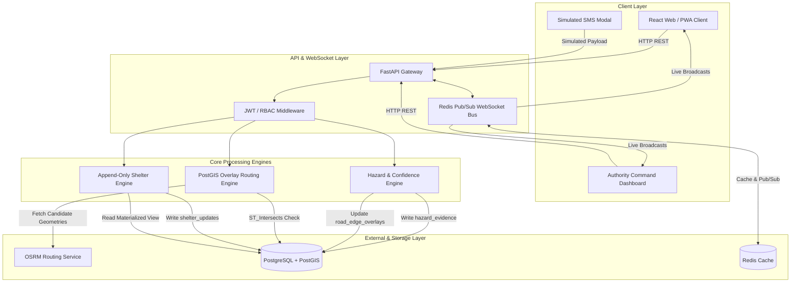
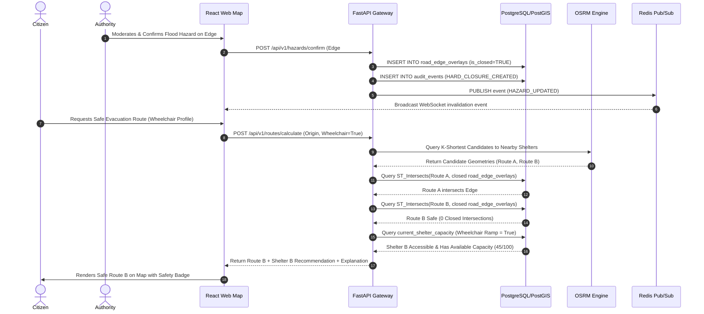

# resQroute Relationship Graph & System Dependencies

This document details the inter-component relationships, data lineage, and user interaction flows within `resQroute`.

---

## 1. High-Level Service & Component Dependency Graph

---

## 2. End-to-End Emergency Evacuation Data Flow

---

## 3. Data Entity Relationship Summary

| Entity | Primary Key | Foreign Keys | Relationship Summary |
| :--- | :--- | :--- | :--- |
| `users` | `id` | - | Parent user record holding RBAC role and accessibility flags |
| `source_registry` | `id` | - | Lineage tracking entity defining trust levels for data feeds |
| `road_edge_overlays` | `id` | `source_id` | Stores spatial geometries of closed edges & severity levels |
| `hazard_evidence` | `id` | `source_id` | Stores spatial point reports, confidence scores, and raw evidence payloads |
| `shelters` | `id` | - | Static metadata for shelters (location, total capacity, accessibility flags) |
| `shelter_updates` | `id` | `shelter_id`, `actor_id` | Append-only event stream recording timestamped occupancy changes |
| `audit_events` | `id` | `actor_id` | Immutable security log of authority overrides & closures |
| `route_snapshots` | `id` | `user_id`, `target_shelter_id` | Post-disaster audit snapshot of evaluated geometries & risk scores |
